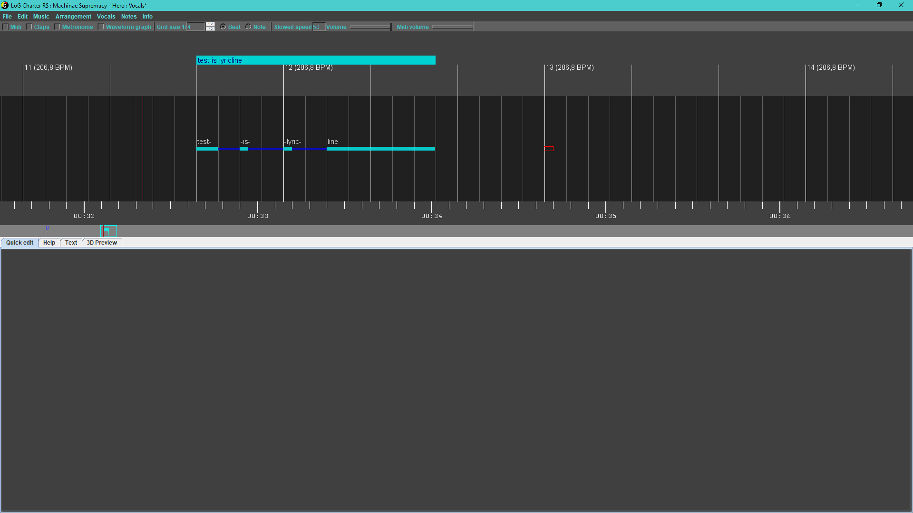

Lords of Games Charter for Rocksmith

# How to start

On Windows, you run the RS Charter.exe

On Mac and Linux you have to run the RS Charter.jar file

To use the program you need to have Java 16 or newer installed on your
system, you can install newest version available from Oracle or any
other distributor, for example OpenJDK, you don't need the same version
of Java.

# File menu

## Options

After you start the program for the first time, you should go to File \>
Options and change settings as you see fit, in particular music and
songs folders.

| Item                     | Description |
| ----                     | ----------- |
| Music folder             | where the window for choosing music for new song will open (default value is user's Music folder)
| Songs folder             | where the new songs will have folders created by default (default value is user's Documents folder)
| Minimal note distance    | distance between end of one note and start of next note (doesn't apply to linked notes) (default value is 50 ms)
| Minimal note tail length | notes shorter than this will be reduced to length 0 (default value is 50 ms)
| Sound delay              | delay of your audio system (default value is 25 ms)
| Midi sound delay         | delay of your midi device (default value is 200 ms)
| Marker position          | position of time marker on screen (default value is 300 px)
| Note width, Note height  | size of notes on edit panel (default values are 15 x 25 px)
| Chart map size           | multiplier for chart map height (default value is 3)
| Invert strings           | whether strings should be inverted in the editor (default value is false)
| Left handed              | whether 3D preview should be inverted left to right (default value is false)
| Show chord ids           | debug option that shows chord numbers in the arrangement, helpful for finding similarly looking chords that are different (default value is false)
| Show grid                | whether to show grid in the editor or not
| Create stretched audio   | If checked, editor will make slowed down versions of the song in the background when the song chart is made, if unchecked they will be created on demand (this takes few minutes though, so it's better to leave this checked unless you lack disk space)
| FPS                      | frames per second (default value taken from your screen's data)
| Backup delay             | time between backups in the background (in seconds, 10 minutes by default)
| Graphical theme          | choose editor's theme, which will change details on notes

## Creating a chart

To create a chart, you click the File \> New menu option, which will
show music file chooser.

After selecting your desired music file in .ogg or .mp3 format, program
will ask whether you want to make new folder in your songs directory, or
use the folder where audio is stored. You can change name of the folder,
by default the name is \<artist\> - \<title\>, taken from audio file's
metadata.

After clicking "Save", chart files will be created.

## Opening existing chart

If you want to open song that has arrangement already but wasn't made
in this editor, you can create new song based on selected arrangement
file in File \> Open song from RS arrangement XML.

Program will ask you to select music file and then .xml file with
arrangement, and will use folder where audio file is as project folder.\
You should only use this option to make editor's project in existing
chart folder.

## Using separate audio file

You can open different audio file for playback fy using File \> Open
audio file option.

This will only change playback audio and not overwrite music file of the
project.

## Importing existing arrangement

You can import guitar/vocals arrangements to add them to existing
project in the File \> Import menu.

## Importing guitar pro file

In the File \> Import menu there is an option to import Guitar Pro file.

If tempo map is not set yet, it will be taken from GP file.

GP file import will add new arrangement(s) with auto generated hand
shapes and anchors, and without tone changes, sections, phrases or
events.

After import, you can select new arrangement in the Arrangement menu.

Currently only Guitar Pro 3, 4 and 5 files can be imported, newer
formats coming soon.

## Graphic options

You can set custom colors for the editor here (some color changes might
need restart of the editor).

# Edit menu

## Special paste

By using ctrl + shift + V shortcut, you can paste more than just
selected objects.

When pasting like this, all objects from start to end
of your selection get copied, and can be pasted, including every option
seen on the popup. You can use this to copy whole parts of the song.

## Song options

Song options can be used to change title, artist, album and year of the
song.

## Add silence to the beginning

You can add seconds of silence to the beginning of the song or set first
beat to be on given value.\
Another menu position sets first beat at 10s and adds given amount of
bars.

For now feature works only on Windows, you need to do it manually using
eg. Audacity on other systems.

# Music menu

You can set speed of slowed down audio there.

# Arrangement menu

It contains all arrangements, levels and arrangement options.

## Tempo map

Changes to tempo map edit mode, which is also default for new songs.

You can right click on a tempo to change the time signature.

In this mode you can change tempo by dragging beats around.

If you drag first beat, you move the whole chart.

For all other beats, after you drag the beat around, beats between
dragged one and last anchored will get spread evenly, and same happens
for dragged and next anchored beat, if there is no next anchored beat,
editor takes BPM of last beat before dragged one and sets it as BPM for
rest of the song.

Anchored beats will have little arrows at the top.

Moving beats will move positions on all arrangements accordingly, so you
can fix the tempo after placing the notes if you need to, but you should
start with getting it right because it helps in later stages.

It is good to use Waveform graph and Metronome to
confirm that the beats are placed correctly, you can toggle them with F5
and F4, or on the toolbar.

After you finish making tempo map, you should make or edit an
arrangement.

## Vocals arrangement

Changes to vocals edit mode.

You can right click to add/remove a vocal. When creating a vocal, you
need to enter text that will show (- at the end will mark vocal as
linked to next, + will mark it as phrase end). Saving with no text will
delete a vocal.

Left click selects and moves vocals around.

When selected, vocals' lengths can be changed with scroll wheel, and
quick edit on the bottom will show current values.

Double click or L can be used to open edit popup. If multiple vocals are
selected when pressing L, they will be edited each after another.

W and E are shortcuts for toggling word part and phrase end flags.

Full phrases are shown above the edit area.

## New arrangement

Adds new arrangement to the project.

You can set type of arrangement (Combo, Rhythm, Lead, Bass), subtype
(Main, Bonus, Alternate),

base tone name, number of strings, capo and tuning. You can edit those
later in Arrangement \> Arrangement Options.\
When changing tuning later, you will also have option to move frets on
strings that changed values.

Changes to guitar edit mode.

## Guitar arrangement

Selecting any of guitar arrangements will change editor to guitar
editing mode.

Difficulty levels will show under the arrangements when guitar
arrangement is selected.

# Notes menu

Notes menu contains options for grid.

You can change size of the grid, unit it's based on (note or beat), and
use , and . to double/halve the grid size.

# Guitar arrangement editing

When editing guitar arrangement, you have main area where you can place
notes, anchors, hand shapes, sections, phrases, events and tone changes.

## Sections, phrases and events

To add, edit or remove sections, phrases and events, you right click the
area above the beat line.

When you do, edit window will appear for that position
that lets you edit these values.

## Tone changes

Just below the beat you have tone change area, right clicking in it will
let you add, edit or remove tone change. The input has autocomplete
functionality that hints you already used tone names.

Remember that you can only use 4 tones per arrangement.

## Anchors

Right clicking the area just above notes area will add or edit an
anchor.

Fret is the fret that index finger should be put on,
while width is the spread of what you should cover in this position.

If you use tapping, remember to make anchor reach the top note so it
won't jump between high and low notes.

## Hand shapes

Clicking just below the note area will let you add or
remove a hand shape.

Hand shapes are automatically added for each chord when saving.

You can use hand shapes to mark arpeggios instead of chords too, you
should then select the arpeggio flag on the hand shape edit popup.

## Editing notes

### Right click

You can right click to add or remove notes, you can hold and drag to
place multiple notes at the same time.

### Left click

You can left click to select or drag notes.

### Numeric buttons

You can use button 0-9 to input fret of all selected sounds.

All single notes will move to fret you typed.

Chords will put lowest fret in the shape at the typed fret.

### Bookmarks

You can use ctrl + 0-9 to toggle bookmark at current position.

You can move to bookmark by pressing shift + 0-9.

### Up and down

You can press up and down to move notes between strings, if you hold
ctrl it will change strings but leave the sounds the same (it will
change frets).

### Shortcuts

You can use shortcuts described in the Guitar menu to quickly cycle note
statuses of all selected notes:

| Key       | Shortcut action |
| ----      | --------------- |
| M         | cycle mutes (None, Palm, Full)
| H         | cycle HO/PO (None, Hammer On, Pull Off, Tap)
| O         | cycle harmonic (None, Normal, Pinch)
| A         | toggle accent
| V         | toggle vibrato
| T         | toggle tremolo
| L         | toggle link next
| Shift + H | make a hand shape over selected sounds, with template from first selected chord
| F2        | toggle Midi
| F3        | toggle claps
| F4        | toggle metronome
| ./,       | double/halve grid size
| G         | open grid options popup

### Other buttons and actions

| Key                         | Shortcut action |
| ----                        | --------------- |
| ctrl + left click           | add to selection
| ctrl + shift                | add to selection all objects from last selected to clicked
| scroll wheel                | change length of selected notes/hand shapes
| shift + scroll wheel        | change length faster
| ctrl + scroll wheel         | change editor's zoom
| ctrl + shift + scroll wheel | change zoom faster
| left/right                  | move position
| ctrl + left/right           | move position slower
| shift + left/right          | move position faster
| alt + left/right            | move between beats
| alt + ctrl + left/right     | move between grid positions
| ctrl + shift + V            | special paste

### Copy and paste

Copied data is stored as a xml, so it can be saved as text for later.

You can use ctrl + shift + V to paste more than just selected copied
values.

### Chart map

Under the editor is chart map. You can click on it to move around the
chart quickly, and it shows where you are and bookmarks, and also
different other things based on mode:

-   In tempo mode it will show bars:
 
    
    
-   In vocals mode it will show lyric lines:

    

-   In guitar mode it will show phrases, sections and notes

    

### Quick edit

Below the edit area are tabs with Quick edit, Help, Text and 3D Preview.

Help just shows FPS for now.

Text can be used as temporary notepad or to hold lyrics as you edit
them.

3D preview shows how the arrangement will approximately look like in the
game.

The quick edit is made of few parts, changing depending on selected
content. It allows you to change values of most objects, that is tone
changes, anchors, notes, hand shapes and vocals.

Quick edit for tone changes, anchors and vocals looks just like the
popup.

For notes and hand shapes there are few parts:

-   note options
    -   first there are strings that you want to edit (only notes on
        selected strings will have values changed, for chords you can
        change values of specific chord notes this way)
    -   below are string and fret (only filled for single notes)
    -   then Mute, HOPO, Bass picking, Harmonic and other statuses

    

-   chord template editor
    -   has chord name input that suggests already used chords if you
        start typing name or frets
    -   has a button to suggest chord name based on its shape
    -   below that is area where you can edit the shape via inputs or by
        clicking on the strings
    -   you can press buttons for fingers (1, 2, 3, 4, T) while hovering
        over the strings to set the finger for that string
    -   works the same way for both chords and hand shapes

    

-   bend editor

    

    -   you can use radio buttons to select strings
    -   you can left click to add or move a bend point
    -   you can right click to remove a bend point

    

### 3D Preview

Helpful to see if the chart isn't cluttered or if anchors and notes are
placed right, you can press F11 to make it full screen.

# Terminology

| Term | Description |
| ---- | ----------- |
| Accent | striking strings harder to make louder sound
| Anchor | also called fret hand position (FHP), in the game it tells where to place your left hand, has fret and width as values (default width is 4), should be placed on note that makes you move your hand
| Bass picking technique, Pop | pulling on the string before releasing it
| Bass picking technique, Slap | slapping string with a thumb instead of plucking it
| Beat | horizontal line representing point in song time, it has time signature that marks every nth beat as primary, and can be anchored which means it has fixed position, beat is anchored after you drag it
| Bend point | position in note with defined bend value
| Chord | set of notes played together, each chord has a template assigned, if chord repeats, only the chord box is visible
| Chord template | shape of a chord with placement of fingers
| Chord note | note of a chord, each can be edited separately, if chord has different values on chord notes, it shows the notes.
| Claps | plays beep on every note in arrangement
| Crazy/Arpeggiato | allows you to place sustain passing other notes, can cause chart to be difficult to read
| Event | things like crowd cheering
| Hand shape | the duration for which you should hold a chord, can be marked as arpeggio
| Harmonic | sound created by multiplying base note
| Harmonic, Normal harmonic | played by touching string with left hand exactly where it divides nicely, for example:  12th fret for ½ → 2x higher pitch 9th fret for 2/5 → 5x higher pitch 7th fret for 1/3 → 3x higher pitch 5th fret for ¼ → 4x higher pitch 4th fret for 1/5 → 5x higher pitch lower denominators are easier to play
| Harmonic, Pinch harmonic | played by touching the string in a harmonic point with right hand while plucking the string, multiplies fretted note pitch instead of open note one
| HO/PO | technique of playing note without plucking the string
| HO/PO, Hammer on (HO) | hitting the string on the fret with finger of the left hand
| HO/PO, Pull off (PO) | releasing string with finger on left hand in a way that lets it ring out
| HO/PO, Tap | you tap the string on a fret with finger of right hand
| Ignore | makes Rocksmith not check whether sound was played right for song score
| Link next | links note to next note, removing note head from note after
| Metronome | beeps on every beat
| Midi | plays midi notes based on current arrangement
| Mute | can be set to full (frethand), palm or none
| Mute, Full mute | you mute the strings by touching them with fingers of left hand, but not holding them down to frets
| Mute, Palm mute | you hold palm of your right hand on the strings
| Phrase | part of a section, could be repeated multiple times, has difficulty that show as a column in Rocksmith.
| Section | section of the song, shows as orange line under the phrases in Rocksmith
| Slide | changing frets by moving left hand between frets
| Slide, pitched | moving it to new fret that should ring out
| Slide, unpitched | moving it in a direction, then usually letting it go silent
| Split (chord) | forces splitting chord into normal notes placed onthe same position
| Tremolo | technique where you pick the string/s repeatedly
| Vibrato | technique where you repeatedly slightly bend the string/sto make the pitch vibrate
| Vocal | part of lyrics, usually word or syllable, can be linked to next vocal or marked as end of phrase (lyric line)
| Waveform graph | visually represents song's audio, different color for audio parts with high RMS
